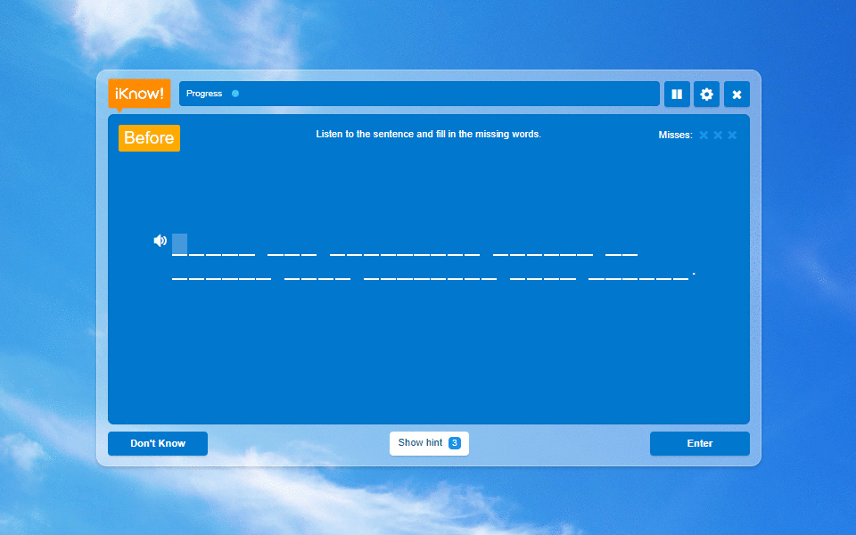

Better iKnow!
=============

This is a Chrome extension to make [iKnow](http://iknow.jp/) dictation app easier to type.

Description
-----------

[iKnow!](http://iknow.jp/) is a service for English learning. Although its main app focuses to vocabulary, it also provides a dictation app. However, the user experience of this dictation app is a little stressful for me. This extension makes the app:

* reject incorrect inputs to prevent advancing the cursor with incorrect letters
* notify incorrect inputs with visual and sound
* disable unnecessary cursor-movement keys (<kbd>Left</kbd>, <kbd>Right</kbd>, and <kbd>Back Space</kbd>)

License
-------

MIT

Author
------

[shingo45endo](https://github.com/shingo45endo)
